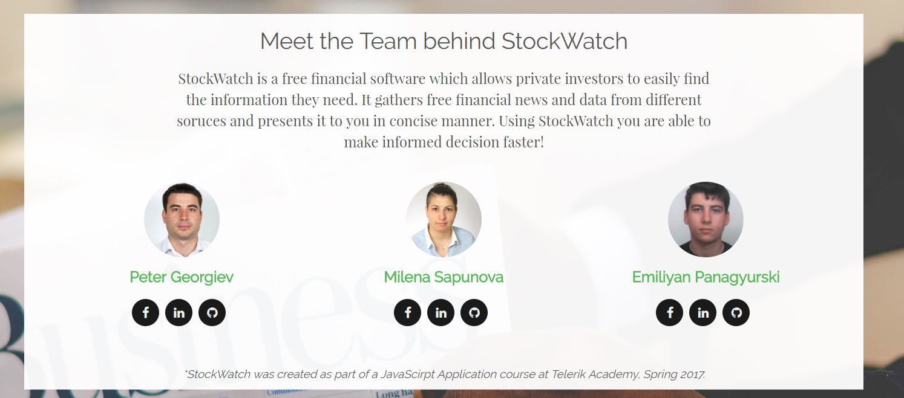
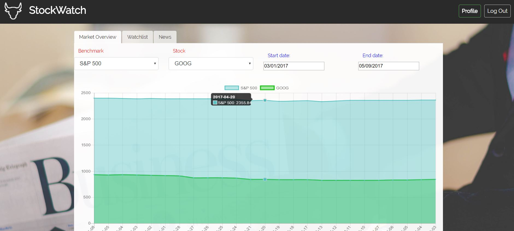
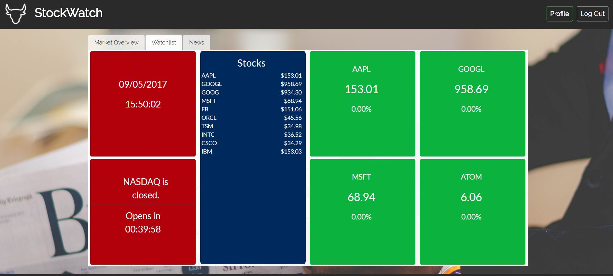
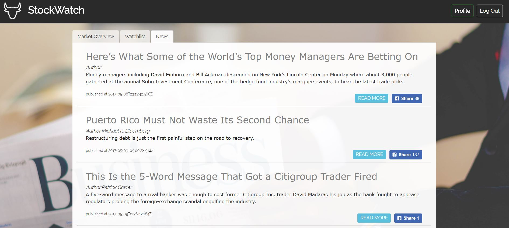
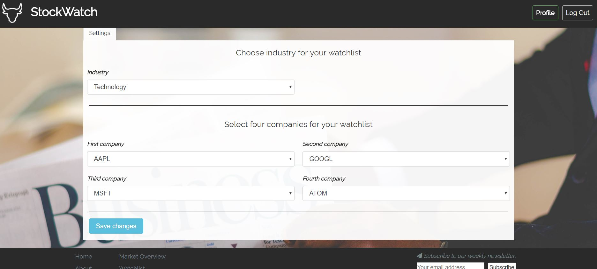

# StockWatch

JavaScript Applications | Team "Basilisk" | Business Application

### StockWatch Application
This application was created as part of the teamwork assignment for the course JavaScript Application (April 2017) at Telerik Academy by Team 'Basilisk'. The application gathers real time financial information from various sources and presents it to the user in a concise manner. StockWatch provides data for all stocks included in the [NASDAQ Company List](http://www.nasdaq.com/screening/company-list.aspx). This includes companies listed on [NASDAQ](http://www.nasdaq.com/), [NYSE](https://www.nyse.com/index) and AMEX. Real time and historical stock data are downloaded form [Yahoo Finance](https://finance.yahoo.com/) and [Google Finance](https://www.google.com/finance). The source of the financial news is [Bloomberg](https://www.bloomberg.com/), but they are provided via [News API](https://newsapi.org).

The application is to be further developed by adding features like 
* Provide news about the industry and companies chosen by user
* Choose stock exchange to follow (open/close)
* Portfolio (building a portfiolio by picking stocks, visualizing portfolio historical performance)
* Using an algorithm to show buy/sell recommendation
* Adding other financial instruments: bonds, options, etc.

### Team Members
The following team members were randomly chosen to participate in the team project assignment as **Team 'Elderberry'**:

| Name                     | *Username*              | *GitHub*                                                      |
| -------------------------| ------------------------| --------------------------------------------------------------|
| Milena Sapunova          | *milena.aleksandrova*   | [pokemon4e](https://github.com/pokemon4e)                     |
| Peter Georgiev           | *peter_85*              | [peter-85](https://github.com/peter-85)                       | 
| Emiliyan Panagyurski     | *EmiliyanPanagyurski*   | [EmiliyanPanagyurski](https://github.com/EmiliyanPanagyurski) |
 
### Project Purpose:
After successfully registering on StockWatch, the user is presented with the user settings. He can choose his industry of interest and four companies he is particularly interested in. One can follow those companies and industry in the Watchlist tab. There the users sees the current time and the time left until open/close of the [NASDAQ](http://www.nasdaq.com/).

Additionally, one can see the stock price of the top 10 companies by market capitalization in the chosen industry; Furthermore, the real time stock price, the percentage change and the ticker are displayed for each of the four companies specified in the user settings. 

On the Market Overview tab one can compare a stock performance to a specific benchmark (S&P 500, Dow Jones Industrial Average, Nasdaq Composite, Russell 2000). Only stocks within the specified industry are shown. 

In the News tab one can see the last 10 news from Bloomberg. There is an option to share the news on Facebook.

### Screenshots		   

 
  
 
 
 
 
### URLs
[**Live Demo**](https://stock-watch-eab0d.firebaseapp.com/)

[**Video Presentation**](https://www.youtube.com/)

[**Link to GitHub repository**](https://github.com/TelerikTeamBasilisk/StockWatch)